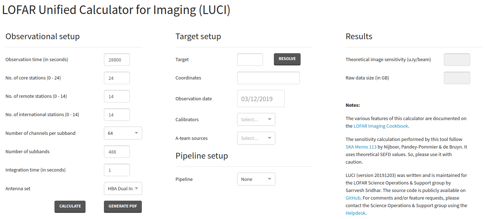
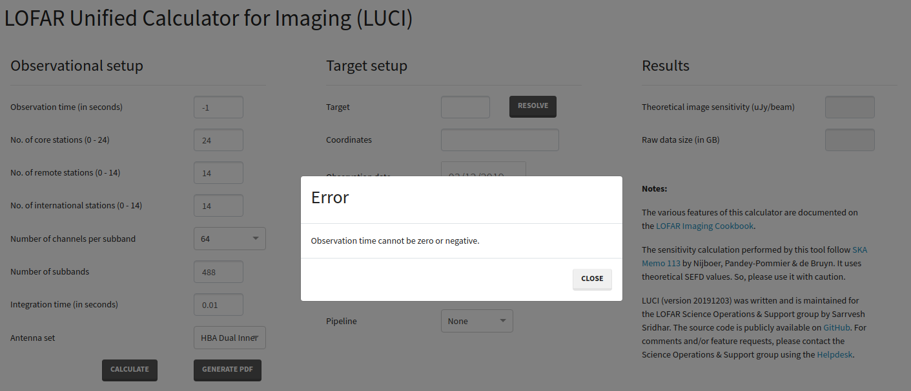
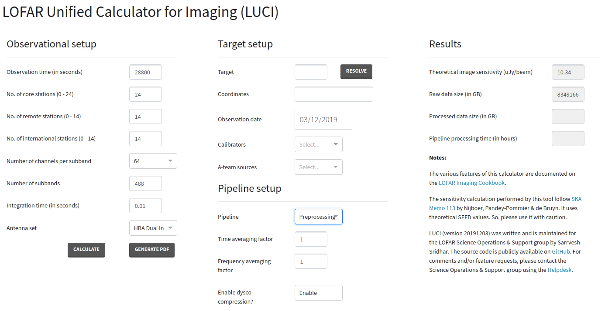

LOFAR Unified Calculator for Imaging (LUCI) [#f1]_
==================================================

The LOFAR Unified Calculator for Imaging, or LUCI, is a unified web interface that allows users to compute several parameters relevant for planning an interferometric observation with LOFAR. The web interface can be accessed at `https://support.astron.nl/luci <https://support.astron.nl/luci/>`_. A similar tool for planning beamformed observations is under development. 

LUCI is developed and maintained by the LOFAR Science Operations & Support (SOS) group at ASTRON. The source code is publicly available on GitHub at `https://github.com/scisup/LOFAR-calculator <https://github.com/scisup/LOFAR-calculator>`_. For comments and/or feature requests, please contact the SOS group using the `JIRA Helpdesk <https://support.astron.nl/rohelpdesk>`_.

For a given observation and pipeline setup, the web interface allows users to

+ compute the raw and processed data size,
+ compute theoretical image sensitivity,
+ estimate the pipeline processing time,
+ plot the elevation of the sources to observe on any given date, 
+ plan multi-beam observations, and
+ export the observation and pipeline setup in a PDF format.

The landing page of the LUCI web interface is shown below in :numref:`luci_interface`. The page is divided into three columns each allowing the user to set a specific aspect of the observation. By setting different input fields, users can compute some or all of the parameters listed above. The different functionalities of LUCI are explained below. 

.. _luci_interface:

   
   The web interface to the LOFAR Unified Calculator for Imaging (LUCI).

-------------------------
Setting up an observation
-------------------------

The **Observational setup** section in LUCI allows users to specify an interferometric observing run with LOFAR. The 

+ **Observation time (in seconds)** -- Duration of an observing run (default: 28800 seconds),
+ **No. of core stations (0 - 24)** (default: 24)
+ **No. of remote stations (0 - 14)** (default: 14)
+ **No. of international stations (0 - 14)** (default: 14)
+ **Number of channels per subband** -- Frequency resolution of an observing run. Allowed values are 64, 128, and 256 channels per subband (default: 64)
+ **Number of subbands** -- Number of subbands to record as part of the observing run (default: 488).
+ **Integration time (in seconds)** - Correlator integration time. This input field determines the time resolution of the observing run. (default: 1 second)
+ **Antenna set** -- specifies the mode in which the stations are operated. Allowed values are LBA Outer, HBA Dual, and HBA Dual Inner. (default: HBA Dual Inner).

Upon clicking the button **Calculate**, LUCI computes the theoretical image sensitivity and the raw data size. The results of this computation is displayed to the user under the **Results** section. Note that before doing the calculations, LUCI validates the input specified by the user. If an invalid input is detected, LUCI displays an error as shown in :numref:`luci_error`.

.. _luci_error:

   
   Example error message displayed to the user. Before performing the calculations, LUCI validates the user input. If an invalid input is detected, LUCI shows a similar error message.

-----------------------------------
Setting up a preprocessing pipeline
-----------------------------------

Pipelines can be setup in LUCI using the field **Pipeline** dropdown button under **Pipeline setup**. At the moment, only a preprocessing pipeline can be specified. By default, no pipeline is attached to the observing run and hence the field **Pipeline** is set to None. To attach a preprocessing pipeline, set the **Pipeline** field to **Preprocessing**. Toggling the **Pipeline** field reveals a few more input fields (see :numref:`luci_pipeline`) under **Pipeline setup** which can be used to tweak the behaviour of the pipeline. The new, pipeline-specific fields are 

+ **Time averaging factor** How much averaging to perform along the time axis (default: 1),
+ **Frequency averaging factor** How much averaging to perform along the freqency axis (default: 1), and
+ **Enable dysco compression?** Should the output measurement sets produced by the preprocessing pipeline be compressed with Dysco? (default: Enabled).

Upon clicking the **Calculate** button, LUCI calculates **Processed data size** and **Pipeline processing time** in addition to **Theoretical image sensitivity** and **Raw data size** mentioned earlier.

.. _luci_pipeline:

   
   LUCI web interface showing the pipeline fields that are revealed when the field **Pipeline** is set to **Preprocessing**.

.. _target_setup:

---------------------------------------------------
Specifying targets, calibrators, and A-team sources
---------------------------------------------------

In addition to calculating the data sizes and processing times, LUCI also allows users to check if their target of interest is visible to LOFAR on a specific date. The target of interest can be specified in the **Target** field under the **Target setup** section. If the specified source is valid, the **Resolve** button can be used to obtain the coordinates of that source. If however, the user wishes to manually input the coordinates, a target name must also be specified. The specified target name **Note** that an error message is thrown if the number of sources mentioned in the **Target** field does not match 

----------------------------------
Setting up multi-beam observations
----------------------------------

In the previous section, we demonstrated how to ...

-------------------
Exporting the setup
-------------------

--------------------------------
Frequently Asked Questions (FAQ)
--------------------------------

**In what framework is LUCI implemented?**

    LUCI is implemented in using the `Dash <https://github.com/plotly/dash>`_ which is a simple Python framework for building web applications. Interactive plotting is done using `Plotly <https://github.com/plotly/plotly.py>`_.

**Can I contribute to LUCI?**

    Sure! The source code of LUCI is available on `GitHub <https://github.com/scisup/LOFAR-calculator>`_. If you have an interesting feature, feel free to submit a pull request to this repository.

.. rubric:: Footnotes

.. [#f1] This chapter was written by `Sarrvesh Sridhar <mailto:sarrvesh@astron.nl>`_.
