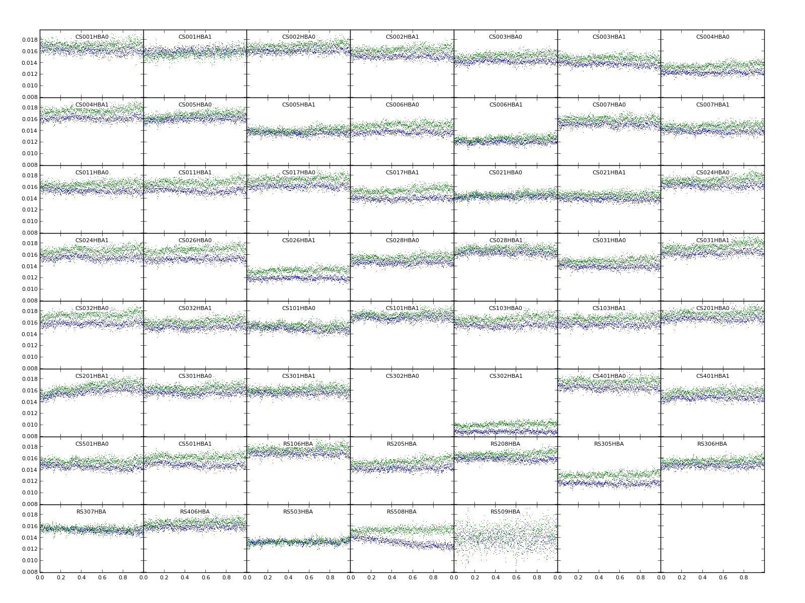
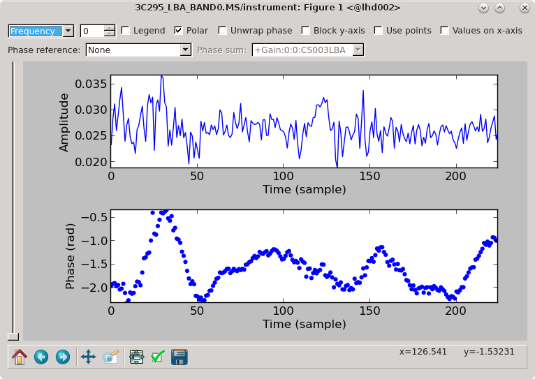

Practical examples [#f1]_
=========================

In this Chapter, examples of how to inspect and analyse LOFAR data are given. The aim of these exercises is for the User to become familiar with the software used to process LOFAR data and to be able to apply this knowledge to other data sets. Please note that each LOFAR data set is different and special care should be taken when directly applying the methods given in these exercises to other LOFAR data sets.

It is assumed that the user is working on the CEP3 cluster and is familiar with the working environment.

The tutorial data can be staged and downloaded from the LOFAR `Long Term Archive <http://lta.lofar.eu>`_. Using the project link on top of the page, select "other projects" in the list of links which will appear, and click on the "LOFARSCHOOL" link in the list of projects. Then, click on the "Show Latest" link at the top of the page, and on "All observations and pipelines".

Selecting the checkbox in each row and clicking on the "stage selected" link will stage the data and you will get an email with the download instructions. This assumes that you have an user account registered. More info on how to use the LTA interface can be found on the `LOFAR wiki <http://www.lofar.org/wiki/doku.php?id=public:lta\_howto>`__. 

Sky models and parset files used in the tutorial can be found at the LOFAR `GitHub repository <https://github.com/lofar-astron/LOFAR-Cookbook/tree/master/Tutorial>`__. 

---------------------------------
Flagging, averaging, and demixing
---------------------------------

The naming convention for each measurement set (MS, also referred to as a sub-band) is 
Laaaaaa\_SAPbbb\_SBccc\_uv.MS, where Laaaaaa is the observation/pipeline ID, SAPbbb is the sub-array pointing (beam), andSBccc is the sub-band number. We can, for example, obtain a summary of a measurement set using msoverview; for more detailed report, we use the "verbose" argument to the command::

   msoverview in=L456104_SAP000_SB001_uv.MS verbose=T
   
Along with the details of the MS, we get a message: "This is a raw LOFAR MS (stored with LofarStMan)", which means that the data cannot be handled with Casa. To fix this, we can use the following DPPP parset::

 msin=L456104_SAP000_SB001_uv.MS
 msout=L456104_SAP000_SB001_uv_copy.MS
 msin.autoweight=True
 numthreads=4 # so that the nodes are not overloaded, usually can skip this line
 steps = [ ]
 
after execution, the output MS can be opened using the standard CASA tools. Moreover, proper weighting of the data has been implemented.

The data can be inspected using casaplotms [#f2]_ as ::

 module load casa
 casaplotms &
 
Open the measurement set from the GUI. Plot the XX correlation only by using the 'corr' argument (to speed things up). Select only cross correlations by typing "*&*" in the 'antenna' field (note: * - any antenna; & - cross correlations). There are many large spikes, likely caused by RFI. Click on the 'Axes' tab and adjust the y-axis range to something more sensible to find the real astronomical signal (:numref:`inspectcasaplotms`).	

.. _inspectcasaplotms:

   
   Inspecting the visibilities in casaplotms.

We can also further visualize the impact of RFI in the measurement set using rfigui. ::

 rfigui L456104_SAP000_SB001_uv_copy.MS &
 
In the smaller menu that pops up, just choose "Open". Then, in the new window, select index 0 (default) for antenna 1, and index 1 for antenna 2, before clicking on "Load". This will plot the short intra-station baseline CS001HBA0 - CS001HBA1. There is some clear narrow-band RFI. You can create a power spectrum (using "Plot"). rfigui can flag the data using AOFlagger: "Actions", then "Execute Strategy". There are other useful plots in the plot menu.

The AOFlagger can be called with DPPP. Create and run this parset (you can pipe the output to a log file, e.g. **DPPP your.parset | tee DPPP.log** ::

 msin=L456104_SAP000_SB001_uv_copy.MS
 msout=L456104_SAP000_SB001_uv_copy_flg.MS
 numthreads=4
 steps=[preflagger,aoflagger]
 preflagger.baseline=*&&&;RS208HBA;RS210HBA;RS310HBA;RS406HBA;RS407HBA;RS409HBA;
 RS508HBA;RS509HBA;RS205HBA&RS307HBA # all these stations on one line

An explanation of the "preflagger" step is as follows. The first argument (arguments separated by semi-colons) removes the autocorrelations (although note that AOFlagger also does this by default). For the next eight arguments, we remove all baselines including the stated remote station as well as one particular baseline between two remote stations (identified as bad data which can affect the calibration). The default AOFlagger strategy is run, but many options can be specified in DPPP (see the LOFAR wiki). We can re-examine the data with casaplotms and see that the RFI has been removed.

The observation we are working on is close to two "A-team" sources: about 16 deg from Cyg A, and 21 deg from Cas A. We need to check if their influence should be "demixed" from the recorded visibilities. Firstly, let's check their elevations during the observation::

 plot_Ateam_elevation.py L456104_SAP000_SB001_uv_copy_flg.MS
 
We can predict the associated visibilities through simulations. Or, we will run a tool called the Drawer, allowing one to quickly inspect a measurement set and investigate which sources are contributing to the visibilities. ::

 /home/tasse/drawMS/drawMS --ms=L456104_SAP000_SB001_uv_copy_demix_demo.MS
 
Note that we are running the Drawer on pre-prepared averaged data (to save time); we will learn how to do averaging shortly. Examine the Drawer output. One can see contributions from Cas A and Cyg A. We need to demix their influence from the data.

We need a model of the A-team sources::

 showsourcedb in=Ateam.sourcedb mode=patch # verify database contents

Use the following parset for DPPP::

 msin=L456104_SAP000_SB001_uv_copy_flg.MS
 msout=L456104_SAP000_SB001_uv_copy_flg_demix_avg.MS
 numthreads=4
 steps=[demix]
 demix.subtractsources=[CasA,CygA]
 demix.skymodel=Ateam.sourcedb
 demix.timestep=10
 demix.freqstep=16
 demix.demixtimestep=60
 demix.demixfreqstep=64

The arguments "timestep" and "freqstep" compress the data in time and frequency, respectively, by the given factors. Demixing two sources at once can be very time consuming. Thus, "demixtimestep" and "demixfreqstep" have been chosen to have rather coarse values (usually default to "timestep" and "freqstep" without needing to be specified).

We can draw the demixed data to see the result:

.. figure:: figures/tut_demix_post.png
   :align: center
   
   A Drawer plot of the data before and after demixing.

What if demixing is not needed? We can also just average in time and frequency. Here is an example parset that could be run through DPPP::

 msin=L456104_SAP000_SB001_uv_copy_flg.MS
 msout=L456104_SAP000_SB001_uv_copy_flg_avg.MS
 numthreads=4
 steps=[averager]
 averager.timestep=10
 averager.freqstep=16

DPPP was designed to run pipelines containing multiple steps. The following parset combines all the steps run so far in this tutorial, except demixing::

 msin=L456104_SAP000_SB001_uv.MS
 msin.autoweight=true
 msout=L456104_SAP000_SB001_uv.MS.dppp
 numthreads=4
 steps=[preflagger,aoflagger,averager]
 preflagger.baseline=*&&&;RS208HBA;RS210HBA;RS310HBA;RS406HBA;RS407HBA;RS409HBA;
 RS508HBA;RS509HBA;RS205HBA&RS307HBA
 averager.timestep=10
 averager.freqstep=16

-----------
Calibration
-----------

You will need to stage and download the calibrator data from the LOFAR LTA with the Observation ID (SAS ID): 456102. Place these in a folder named "calibrator". The target data can be staged and downloaded in the same manner. Their observation ID is: 456106. Place the target data in a folder named "target". You can inspect them and if needed, flag outliers in a manner analogous to the procedure given in the previous sub-section. You do not need to process the complete target data set. For example, a subset of 5 SBs can be selected for calibration.

Take the **A-Team_lowres.skymodel** file, place it in the top directory, and run::

 module load Lofar
 makesourcedb in=A-Team_lowres.skymodel out=A-Team_lowres.sourcedb format="<"
 
to create a sky-model in **sourcedb** format.

Move to the calibrator folder, copy the model there and create a **predict_model.parset** file with the contents::

 msin =
 msin.datacolumn = DATA
 msin.baseline = [CR]S*&
 msout = .
 msout.datacolumn = MODEL_DATA
 numthreads = 5
 steps = [predict]
 predict.type=predict
 predict.sourcedb=A-Team_lowres.sourcedb
 predict.sources=CygA
 predict.usebeammodel=True

Predict the model data for all of the calibrator sub-bands by executing the following bash script::

 for i in *MS; do NDPPP predict_model.parset msin=$i msout=$i; done

Create the parset we will use for calibration, **gaincal.parset** ::

 msin=
 msout=.
 msin.datacolumn = DATA
 msin.baseline = [CR]S*&
 msout.datacolumn = CORRECTED_DATA
 numthreads = 5
 steps=[gaincal]
 #gaincal.sourcedb=A-Team_lowres.sourcedb
 #gaincal.sources = CygA
 #gaincal.usebeammodel=true
 gaincal.usemodelcolumn=true
 gaincal.parmdb=
 gaincal.type=gaincal
 gaincal.caltype=diagonal

and run DPPP for all the calibrator sub-bands ::

 for i in *MS.flg; do NDPPP gaincal.parset msin=$i gaincal.parmdb=$i/instrument msout=$i; done
 
Collect the solutions for all the sub-bands together using::

 #!/bin/bash
 # To copy the instrument tables in a globaldb
 mkdir globaldb
 i=0
 for ms in `ls -d *MS`; do
 echo "Copying ${ms}/instrument"
 cd $ms
 # copy other tables
 if [ $i == 0 ]; then
 cp -r ANTENNA ../globaldb
 cp -r FIELD ../globaldb
 cp -r sky ../globaldb
 fi
 cp -r instrument ../globaldb/instrument-$i
 cd ..
 i=$((i + 1))
 done
 
Then, transform the global solutions into **.h5** format (suitable for LoSoTo)::

 module load losoto
 H5parm_importer.py -v cal.h5 globaldb
 
Plot, flag and merge the solutions::

 losoto -v cal.h5 losoto.parset
 
using the LoSoTo parset::

 #losoto parset
 LoSoTo.Steps = [plotP1, plotP2, plotP3, plotA1, plotA2, plotA3, flag, flagextend, merge]
 
Then, export the merged solutions::

 H5parm_exporter.py -v cal.h5 globaldb

and copy back the solutions to the individual calibrator measurement sets::

 #!/bin/bash
 # copy back the instrument tables from a globaldb
 # to be run after H5parm_exporter.py
 i=0
 for ms in `ls -d *MS`; do
 echo "Copying back ${ms}/instrument"
 rm -r ${ms}/instrument
 cp -r globaldb/sol000_instrument-$i ${ms}/instrument
 i=$((i + 1))
 done

Now, we need to transfer the solutions from the calibrator to the target. We have to re-write the solutions we have found so that they are time independent, since the target was observed at a different time::

 for i in *MS.flg; do parmexportcal in=$i/instrument out=$i/instrument_tind; done
 
then, we can transfer (apply) the solutions to the target using the following parset::

 msin =
 msin.datacolumn = DATA
 msin.baseline = [CR]S*&
 msout = .
 msout.datacolumn = CORRECTED_DATA
 numthreads = 5
 steps = [applycal, applybeam]
 applycal.type = applycal
 applycal.correction = gain
 applycal.parmdb =
 applybeam.type = applybeam
 applybeam.invert = True

which is needed by DPPP and executed for the complete calibrator and target sub-band list using following Python script (for example)::

 import os
 for i in range(0,29,1):
    if i <10:
	   calib_instrument = 'calibrator/L456102_SB00'+str(i)+'_uv.dppp.MS/instrument_tind'
       targetMS = 'target/L456106_SB00'+str(i)+'_uv.dppp.MS'
	else:
       calib_instrument= 'calibrator/L456102_SB0'+str(i)+'_uv.dppp.MS/instrument_tind'
       targetMS = 'target/L456106_SB0'+str(i)+'_uv.dppp.MS'
 #
	print 'NDPPP appycal.parset msin='+str(targetMS)+' applycal.parmdb='+str(calib_instrument)+''
	os.system('NDPPP applycal.parset msin='+str(targetMS)+' applycal.parmdb='+str(calib_instrument)+'')
	
Finally, after the flux scale has been set, the target data need to be calibrated (phase only). We need a source model of the target field::

 cd target/
 gsm.py [-p patchname] outfile RA DEC radius [vlssFluxCutoff[assocTheta]]
 gsm.py -p P1 P1.sky 315.00000000 52.90000000 5
 makesourcedb in=P1.sky out=P1.sourcedb format="<"
 
and, using the following parset::

 msin=
 msout=
 msin.datacolumn = CORRECTED_DATA
 msin.baseline = [CR]S*&
 msout.datacolumn = DATA
 numthreads = 5
 steps=[gaincal]
 gaincal.sourcedb=P1.sourcedb
 gaincal.sources =
 gaincal.parmdb=
 gaincal.type=gaincal
 gaincal.caltype=phaseonly
 gaincal.usebeammodel=false
 gaincal.applysolution=True

we calibrate the target data::

 for i in *flg; do NDPPP ../phaseonly.parset msin=$i msout=$i.ph gaincal.parmdb=$i.ph/instrument; done

The last line in the parset applies the solutions to the data. Alternatively, we can omit it, and apply the solutions using **applycal** in DPPP with the following parset::

 msin =
 msin.datacolumn = DATA
 msin.baseline = [CR]S*&
 msout = .
 msout.datacolumn = CORRECTED_DATA
 steps = [applycal]
 applycal.type = applycal
 applycal.parmdb =
 
-------
Imaging
-------

The Wsclean imager will be used for imaging. On CEP3, you can start it as: **module load Wsclean**. You can check the versioning: **wsclean --version**, or get to the command line help: **wsclean**

First, pick a random sb and run wsclean as follows::

 wsclean -size <width> <height> -scale <val>asec \
 -name quick L456106_SB010_uv.dppp.MS.ph

Change the sb number to your random sub-band number. Replace **width** and **height** by a number of pixels. **val** is the image resolution, here specified in asec. Determine good values for these for imaging this LOFAR set. You want to go a bit beyond the first beam null. Note that angularwidth :math:`\sim` width x scale.

Note that **val** and **asec** have no space between them, e.g.: **-scale 2.5asec**. Other units can be specified, e.g.: "6amin", "50masec", "0.1deg" In order to keep processing fast for this tutorial, don't make images :math:`>` 4k or wider than 20 deg. This quick imaging should not take more than :math:`\sim` 3 min. WSClean will always automatically perform appropriate w-correction (i.e., corrections necessary for wide-field imaging).

Example command::

 wsclean -size 1400 1400 -scale 50sec \
 -name quick L456106_SB010_uv.dppp.MS.ph
 
This will output "quick-dirty.fits" and "quick-image.fits". Inspect these with your favourite fitsviewer (e.g., kvis, ds9, casaviewer).

   
   Example image of a random SB.
   
The main parameters for cleaning are: 

+ **-niter <count>** Turns cleaning on and sets max iterations. Normally, cleaning should end at the threshold, not at the max iterations.
+ **-mgain <gain>** How much flux of the peak is subtracted before a major iteration is restarted. Depends on how good your beam is. 0.8 is safe, 0.9 almost always works and is faster.
+ **-threshold <flux>** Set the apparent flux (in Jy) at which to stop. Should typically be 3 x :math:`\sigma`.

Run the following command: (still on a single subband)::

 wsclean -size <width> <height> -scale <val>asec \
 -niter <niter> -mgain 0.8 -threshold <flux> \
 -name clean L456106_SB010_uv.dppp.MS.ph
 
For example::

 wsclean -size 1400 1400 -scale 50asec \
 -niter 50000 -mgain 0.8 -threshold 0.1 \
 -name clean L456106_SB010_uv.dppp.MS.ph
 
It is convenient to store the above command in a shell script. Notice in the output the cleaning process::

 == Cleaning (1) ==
 Freed 222 image buffer(s).
 Initial peak: 3.2568
 Next major iteration at: 0.651359
 Iteration 0: (602,465), 3.2568 Jy
 [..]
 Iteration 100: (731,561), 0.789584 Jy
 Stopped on peak 0.646578
 [..]
 == Cleaning (2) ==
 [..]
 Stopped on peak 0.130435
 [..]
 == Cleaning (3) ==
 Major iteration threshold reached global threshold of 0.1: final major iteration.
 Iteration 2000: (545,542), 0.12621 Jy
 Stopped on peak -0.0999906

The threshold is reached in 2000 iterations.

Example command::

 wsclean -size 1400 1400 -scale 50asec \
 -niter 50000 -mgain 0.8 -threshold 0.1 \
 -name clean L456106_SB010_uv.dppp.MS.ph
 

   
   Example of a cleaned vs. dirty image.
   
The LOFAR beam is applied by adding **-apply-primary-beam**. Note that the beam was already applied on the phase centre during calibration (the "applybeam" step in NDPPP). WSClean needs to know this, otherwise it will use the wrong beam. This is specified by also adding **-use-differential-lofar-beam**. Repeat the previous imaging with the beam, similar to::

 wsclean -size <width> <height> -scale <val>asec \
 -apply-primary-beam -use-differential-lofar-beam \
 -niter <niter> -mgain 0.8 -threshold <flux> \
 -name lofarbeam L456106_SB010_uv.dppp.MS.ph
 
For example::

 wsclean -size 1400 1400 -scale 50asec \
 -apply-primary-beam -use-differential-lofar-beam \
 -niter 50000 -mgain 0.8 -threshold 0.1 \
 -name clean L456106_SB010_uv.dppp.MS.ph

   
   Primary beam correction.
   
Read the documentation for **-weight**, **-taper-gaussian** and **-trim**, and optionally other weighting/tapering methods. Repeat the previous imaging, but with settings for these parameters that are useful to:

+ accentuate the diffuse emission; and
+ to make the beam Gaussian like, to measure the flux of the emission more easily.

Correct for the primary beam as before. Like::

 wsclean -size <width> <height> -scale <val>asec \
 -trim <trimwidth> <trimheight> \
 -apply-primary-beam -use-differential-lofar-beam \
 -niter <niter> -mgain 0.8 -threshold <flux> \
 -weight [briggs <robustness> or natural] \
 -taper-gaussian <val>amin \
 -name clean L456106_SB010_uv.dppp.MS.ph
 
Example::

 wsclean -size 1800 1800 -scale 50asec \
 -trim 1400 1400 -weight briggs 0 \
 -niter 50000 -mgain 0.8 -threshold 0.1 \
 -name weighting L456106_SB010_uv.dppp.MS.ph
 

   
   Weighting.
   
Note the negative areas around the diffuse sources. Inspect the "model" image. How did WSClean model the diffuse emission and SNRs? Repeat the previous imaging, but use multiscale. If you feel adventurous, you can play with **-multiscale-scales** and **-multiscale-scale-bias**. However, for LOFAR this is hardly ever necessary. ::

 wsclean -size <width> <height> -scale <val>asec \
 -trim <trimwidth> <trimheight> \
 -apply-primary-beam -use-differential-lofar-beam \
 -niter <niter> -mgain 0.8 -threshold <flux> \
 -weight [your weighting choice] \
 -taper-gaussian <val>amin \
 -multiscale \
 -name multiscale L456106_SB010_uv.dppp.MS.ph
 
Baseline-dependent averaging (only available for versions later than v1.12) lowers the number of visibilities that need to be gridded, which therefore speeds up the imaging. To enable it, one adds **-baseline-averaging** to the command line with the number of wavelengths (:math:`\lambda`) that can be averaged over. Use this rule: :math:`\lambda = \text{max baseline in } \lambda \times 2 \times \pi \times \text{integration time in sec } / (24 * 60 * 60)`. Rerun the previous imaging with b.d. averaging. Turn beam correction off (it does not work together with b.d. averaging yet). Example::

 wsclean -size 1800 1800 -scale 50asec \
 -trim 1400 1400 -weight briggs 0 \
 -multiscale \
 -niter 100000 -mgain 0.8 -threshold 0.15 \
 -baseline-averaging 2.0 -no-update-model-required \
 -name bdaveraging L456106_SB010_uv.dppp.MS.ph
 
Try a second run with more averaging and inspect the difference between the images. How much averaging is acceptable?

Several approaches are possible for combining all bands (i.e. measurement sets / SBs):

+ Run WSClean on each band and combine images afterwards. Only limited cleaning possible.
+ Image all MSes in one run with WSClean. Clean deep, but assumes flux is constant over frequency. 

::

 wsclean -size <width> <height> -scale <val>asec \
 [..] \
 -name fullbandwidth *.dppp.MS.flg.ph
 
This takes quite a lot of time. If you have time, you can run the command. You can also run it with only a few measurement sets. If you run clean on the full bandwidth, you can decrease the threshold significantly, because the system noise will go down by :math:`\sqrt{N}`.

Image all SBs and use multi-frequency deconvolution. Cleans deep and incorporates frequency dependency. Relevant parameters: **-channelsout <count>**, **-joinchannels**, **-fit-spectral-pol <terms>**, **-deconvolution-channels <count>**. Like::

 wsclean -size <width> <height> -scale <val>asec \
 [..] \
 -channelsout <count> -joinchannels \
 -fit-spectral-pol <terms> \
 -deconvolution-channels <count> \
 -name mfclean *.dppp.MS.ph

Decrease the threshold to an appropriate level. Example command::

 wsclean -size 1800 1800 -scale 50asec \
 -apply-primary-beam -use-differential-lofar-beam \
 -trim 1400 1400 -weight briggs 0 \
 -multiscale \
 -niter 100000 -mgain 0.8 -threshold 0.15 \
 -channelsout 14 -joinchannels -fit-spectral-pol 2 \
 -deconvolution-channels 4 \
 -name mfclean *.dppp.MS.ph
 
Analyse the individual output images and the MFS images.

---------------------------------------------------
3C295 -- A bright source at the centre of the field
---------------------------------------------------

In this exercise, the user will calibrate LBA and HBA datasets for 3C295. By the end of the exercise the user should be able to:

+ inspect raw LOFAR data,
+ automatically and manually flag data with DPPP, including demix the LBA data,
+ calibrate the data with DPPP,
+ produce maps with WSClean,
+ create a sky model from the data, and,
+ subtract bright sources using DPPP

The data ara available on the LOFAR LTA, as described at the beginning of this chapter. You will see the HBA data set listed at the top of the page, and if you click on the "Unspecified process" at the bottom, the LBA data set will show up.

Log into one of the compute nodes above, and make a new directory, for example, ::

 ssh -Y lof019
 cd /data/scratch/<username>/
 mkdir tutorial/
 mkdir tutorial/3c295/
 cd tutorial/3c295

You will be using the LOFAR software tools. To initialise these use

 module load lofar
 
^^^
HBA
^^^

The unique LOFAR observation number is L74759 and there are two sub-bands, SB000 and SB001.

The data set is in Measurement Set (MS) format and the filenames are respectively ::

 L74759_SAP000_SB000_uv.MS
 L74759_SAP000_SB001_uv.MS
 
for the two sub-bands.

Inspecting the raw data
-----------------------

It is always useful to find out what the details of the observation are (frequency, integration time, number of stations) before starting on the data reduction. This is done using the command, ::

 msoverview in=L74759_SAP000_SB000_uv.MS verbose=T
 msoverview: Version 20110407GvD
 ================================================================================
           MeasurementSet Name:  /cep3home/williams/tutorial/L74759_SAP000_SB000_uv.MS      MS Version 2
 ================================================================================
            This is a raw LOFAR MS (stored with LofarStMan)
 
    Observer: unknown     Project: 2012LOFAROBS  
 Observation: LOFAR
 Antenna-set: HBA_DUAL_INNER
 
 Data records: 5337090       Total elapsed time = 3599 seconds
    Observed from   12-Nov-2012/12:47:00.0   to   12-Nov-2012/13:46:59.0 (UTC)
 
 
 Fields: 1
   ID   Code Name                RA               Decl           Epoch        nRows
   0         BEAM_0              14:11:20.500000 +52.12.10.00000 J2000      5337090
 
 Spectral Windows:  (1 unique spectral windows and 1 unique polarization setups)
   SpwID  Name   #Chans   Frame   Ch0(MHz)  ChanWid(kHz)  TotBW(kHz) CtrFreq(MHz)  Corrs          
   0      SB-0      64   TOPO     118.849         3.052       195.3    118.9453   XX  XY  YX  YY
 
 Antennas: 54:
   ID   Name  Station   Diam.    Long.         Lat.                Offset from array center (m)                ITRF Geocentric coordinates (m)        
                                                                      East         North     Elevation               x               y               z
   0    CS001HBA0LOFAR     31.3 m   +006.52.07.1  +52.43.34.7         -0.0006       -0.1610  6364572.0471  3826896.235000   460979.455000  5064658.203000
   1    CS001HBA1LOFAR     31.3 m   +006.52.02.2  +52.43.31.8         -0.0013       -0.1617  6364572.3376  3826979.384000   460897.597000  5064603.189000
   2    CS002HBA0LOFAR     31.3 m   +006.52.07.6  +52.43.46.8         -0.0005       -0.1582  6364570.0290  3826600.961000   460953.402000  5064881.136000
   ...
   ...
   43   CS501HBA1LOFAR     31.3 m   +006.51.59.7  +52.44.25.8         -0.0017       -0.1489  6364565.9714  3825663.508000   460692.658000  5065607.883000
   44   RS106HBALOFAR     31.3 m   +006.59.05.6  +52.41.21.6          0.0592       -0.1926  6364586.7503  3829205.598000   469142.533000  5062181.002000
   ...
   ...
   51   RS503HBALOFAR     31.3 m   +006.51.04.8  +52.45.33.2         -0.0095       -0.1330  6364557.2108  3824138.566000   459476.972000  5066858.578000
   52   RS508HBALOFAR     31.3 m   +006.57.13.3  +53.03.21.7          0.0431        0.1202  6364441.8110  3797136.484000   463114.447000  5086651.286000
   53   RS509HBALOFAR     31.3 m   +006.47.04.7  +53.13.30.1         -0.0438        0.2644  6364384.5199  3783537.525000   450130.064000  5097866.146000

 The MS is fully regular, thus suitable for BBS
    nrows=5337090   ntimes=3594   nbands=1   nbaselines=1485 (54 autocorr)

From this, you should see that  HBA_DUAL_INNER mode was used, i.e. the core stations are split in two HBA sub-fields, giving a total of 54 stations, and the size of the remote stations is the same as the core stations. The observation was :math:`\sim1` hour (3599 seconds) with 3594 timestamps so the time resolution is :math:`\sim1` s. There are 64 spectral channels and the frequency is 118.849 MHz for SB000 and  119.044 MHz for SB001, and the total bandwidth for each subband is :math:`\sim0.2` MHz. 

Flagging and data compression
-----------------------------

The data set that we are using is uncompressed and unflagged; the total size of each MS is $11$\,GB. The data flagging and compression are carried out using `DPPP <./dppp.html>`_. Typically, initial RFI flagging and averaging will be done by the averaging pipeline run by the Radio Observatory. Note that the limitation on the compression in frequency is set by the size of the field you wish to image and the amount of bandwidth smearing at the edges of the field. The time averaging is limited not only by the amount of time smearing you will allow but also by the changes in the ionosphere. 

In this example we are flagging the data using the aoflagger algorithm within DPPP. Here we will compress the sub-band to 4 channels in frequency and 5 s in time. The parset file for the flagging and compression should be copied to your working directory, ::

 cat NDPPP_HBA_preprocess.parset
 
 msin = L74759_SAP000_SB000_uv.MS
 msin.autoweight=TRUE
 msin.datacolumn=DATA
 
 msout = L74759_SAP000_SB000_uv.MS.avg.dppp
 msout.datacolumn=DATA
 
 steps=[preflagger0,preflagger1,aoflagger,averager] 
 
 preflagger0.chan=[0,1,62,63]
 preflagger0.type=preflagger
 
 preflagger1.corrtype=auto
 preflagger1.type=preflagger
 
 aoflagger.autocorr=F
 aoflagger.timewindow=0
 aoflagger.type=aoflagger
 
 averager.freqstep=16     # compresses from 64 to 4 channels
 averager.timestep=4     # compresses 4 time-slots into 1, i.e. 4s
 averager.type=averager

This parset file will take the data set, flag and compress and then make a new copy in your working area. If necessary, edit the msin and msout fields to point at your working directory, using your favourite editor (e.g. vim, nano, nedit). To run DPPP use, ::

 DPPP NDPPP_HBA_preprocess.parset > log.ndppp.flagavg 2>&1 &
 
In bash, the **2>&1** pipes both the stdout and stderr to the log file and the **&** runs the task in the background so you can continue working on the terminal.

Depending on the use of the cluster, it will take about $\sim5$ minutes to flag and average the data. The progress bar reports the stage of the initial DPPP steps, not the entire DPPP run, so it will keep running several minutes after the progress bar reaches 100%. 

You can inspect the output log file by using, ::

 cat log.ndppp.flagavg
 
The log file lists the input and output parameters, the level of flagging at each step and the total amount of data flagged. You will see that the total data flagged for each of the flagging steps is 4.7%, 3.4% and 2.6% respectively.

Edit the msin and msout fields of the parset to do the same for the second sub-band. Or you can run it again using the same parset and supplying new msin and msout parameters on the command line, i.e. ::

 DPPP NDPPP_HBA_preprocess.parset msin=L74759_SAP000_SB001_uv.MS \
 msout=L74759_SAP000_SB001_uv.MS.avg.dppp  > log.ndppp.flagavg1 2>&1 &
 
The flagged and compressed data set should now be in your working directory and each MS should have a total size of 333 MB, which is much more manageable than before. You can use msoverview to look at a summary of this data set using. ::

 msoverview in=L74759_SAP000_SB000_uv.MS.avg.dppp verbose=True
 
Post-compression data inspection and flagging
---------------------------------------------

We will use the CASA task plotms to inspect the data. Only limited information for using plotms is given here, the User is directed to the `CASA cookbook <\href{http://casa.nrao.edu/Doc/Cookbook/casa_cookbook.pdf>`_ for full details. ::

 module load casa
 casaplotms
 
:numref:`amptime` and :numref:`ampuv` show the Amp. vs. time and Amp. vs. UV distance (wavelengths) for SB000. Through inspecting the data in casaplotms you should be able to see that CS302HBA0 has consistently low amplitudes and is the only station contributing to the few high amplitudes. If you look back at the logs from the initial NDPPP preprocessing you will notice that about 40-50% of the data for this station was flagged by aoflagger.

.. _amptime:

   
   Plotting the XX visibility amplitude against time.
   
.. _ampuv:
  
.. figure:: figures/tutorial_hba_plotms_raw_amp_uvwave_ant.png
   :align: center
   
   Plotting the visibility amplitude against UV distance in wavelengths.

We will remove CS302HBA0 now with DPPP. This can be done either by flagging it with a preflagger step or, as we will do here, filtering it out. In this way it is completely removed from the MS so we have to specify a new output MS. The DPPP parsets are::

 cat NDPPP.split.sb000.parset
 
 msin = L74759_SAP000_SB000_uv.MS.avg.dppp
 msin.baseline = !CS302HBA0
 msin.datacolumn = DATA
 msout = L74759_SAP000_SB000_uv.MS.avg.dppp.flag
 
 steps=[]
 
 DPPP NDPPP.split.sb000.parset > ndppp.flag0.log 2>&1 &
 
and likewise for the other subband::

 > DPPP NDPPP.split.sb000.parset msin=L74759_SAP000_SB001_uv.MS.avg.dppp \
 msout=L74759_SAP000_SB001_uv.MS.avg.dppp.flag > ndppp.flag1.log 2>&1 &
 
The visibilities after removing CS302HBA0 are shown in :numref:`plotms1a`.

.. _plotms1a:

   
   SB000. Plotting the XX visibility amplitude against UV distance in wavelengths after flagging CS302HBA0. (The colour scheme 'Antenna1' is used here.)

Calibration with DPPP
---------------------

In this example, we will use DPPP to perform the calibration (see also :ref:`calibrationdppp` with DPPP) on single sub-bands. 

Before we can run the calibration, we need an initial sky model for correcting the data and a parset file to direct the calibration. Since 3C\,295 is a well-known calibrator source, we already have a good model for it. The sky model consists of two point sources. ::

 cat 3C295TWO.skymodel
 
 # (Name, Type, Patch, Ra, Dec, I, ReferenceFrequency='150.e6', SpectralIndex) = format
 
 , , 3c295, 14:11:20.64, +52.12.09.30
 3c295A, POINT, 3c295, 14:11:20.49, +52.12.10.70, 48.8815, , [-0.582, -0.298, 0.583, -0.363]
 3c295B, POINT, 3c295, 14:11:20.79, +52.12.07.90, 48.8815, , [-0.582, -0.298, 0.583, -0.363]

Here you can see that the two point-source components on 3C295 have been grouped in a single 'patch'. Note that there are other sources visible within the field of view, but 3C295 should be sufficiently bright to dominate the field.

**ASIDE:** Usually one makes an initial sky model based on what we think the sky looks like at the frequency and resolution that we are interested in. This means constructing a model from good image we have at a different frequency/resolution, or in the case of self-calibration, the image we have just made. Alternatively, a sky model can be created using the gsm.py tool. This tool extracts sources in a cone of a given radius around a given position on the sky from the Global Sky Model or GSM. The GSM contains all the sources from the VLSS, NVSS, and WENSS survey catalogs. See :ref:`GSM` for more information about the GSM and gsm.py.

Running gsm.py without any arguments will show you the correct usage (help). ::

 gsm.py 
 
 Insufficient arguments given; run as:
 
   /opt/cep/LofIm/daily/Tue/lofar_build/install/gnu_opt/bin/gsm.py outfile RA DEC radius [vlssFluxCutoff [assocTheta]] to select using a cone
 
   outfile         path-name of the output file
                   It will be overwritten if already existing
   RA              cone center Right Ascension (J2000, degrees)
   DEC             cone center Declination     (J2000, degrees)
   radius          cone radius                 (degrees)
   vlssFluxCutoff  minimum flux (Jy) of VLSS sources to use
                   default = 4
   assocTheta      uncertainty in matching     (degrees)
                   default = 0.00278  (10 arcsec)

So now we can construct the command to make a model for the 3C295 field::

 gsm.py 3c295_field.model 212.835495 52.202770 3.0
 Sky model stored in source table: 3c295_field.model
 
For now, we will return to using the simple two point source model of 3C295. To be used by DPPP this needs to be converted to sourcedb format::

 makesourcedb in=3C295TWO.skymodel out=3C295TWO.sourcedb format='<'
 
The parset file for DPPP can be found at,

 cat dppp-calibrate.parset
 msin=L74759_SAP000_SB000_uv.MS.avg.dppp.flag
 msout=.
 msout.datacolumn=CORRECTED_DATA
 steps=[gaincal, applybeam]
 gaincal.sourcedb=3C295TWO.sourcedb
 gaincal.caltype=diagonal
 gaincal.usebeammodel=true
 gaincal.applysolution=true 

This is a very simple parset file that solves and corrects the data. To perform the calibration, use the following command::

 DPPP dppp-calibrate.parset > log.ndppp.cal 2>&1 &
 
Note that using the  redirect ':math:`>` log.ndppp.cal' command allows you to save and inspect the output of DPPP and using the '&' at the end runs DPPP in the background, allowing you to continue with other tasks, e.g. you can simultaneously run a similar command for the second sub-band, as before updating the msin parameter::

 DPPP dppp-calibrate.parset msin=L74759_SAP000_SB001_uv.MS.avg.dppp.flag > log.ndppp.cal1 2>&1 &
 
The calibration process should be completed in a few minutes. 

Once complete it is useful to look at the calibrated data with  parmdbplot.py::

 parmdbplot.py  L74759_SAP000_SB000_uv.MS.avg.dppp.flag/instrument/

It is useful to de-select the 'use resolution' option as this will plot all of the solutions that we solved for. After de-selecting the `use resolution' option select a few stations and look at the solutions. :numref:`tutparmdbplot` to :numref:`parmdbRS406` shows some solution plots for SB000.

.. _tutparmdbplot:

   
   The parmdb window. Use this to select the stations for which you want to inspect the solutions, and to change the resolution that is used to display the solutions.
   

   
   The solutions for CS003HBA1.
   

   
   The solutions for CS302HBA1.

.. _parmdbRS406:

   
   The solutions for RS406HBA.

**ASIDE:** While parmdbplot.py is very useful and diverse, sometimes you want a quick look at all the solutions. In python you can use **lofar.parmdb** to read and plot the solutions. This example script plots all the phase and amplitude solutions in a single image (see Fig.~\ref{fig:solplotall})::

 python plot_solutions_all_stations_v2.py -p -a L74759_SAP000_SB000_uv.MS.avg.dppp/instrument/ hba_sb000_gains
 display hba_sb000_gains_amp.png
 display hba_sb000_gains_phase.png
 
.. _solplotall1:

   
   Phase solutions for all stations for SB000 (polarizations in different colours).
   
.. _solplotall2:

   
   Amplitude solutions for all stations for SB000.
   
Or use George Heald's solplot.py or :ref:`LoSoTo`.

We can also inspect the corrected data with casaplotms. Go to the axes tab and plot the amplitude against time for the corrected data by selecting "Data Column: corrected" and plot only the XX and YY correlations. :numref:`corrected_plotms0` to :numref:`corrected_plotms1` show these plots for SB000 and SB001 respectively. For SB000, it is clear that the solutions for CS302HBA1 are also very noisy. For both sub-bands, baselines RS508HBA&RS509HBA (visible in orange) and RS208HBA&RS509HBA (in green) look bad.

.. _corrected_plotms0:

   
   Plotting the XX visibility amplitude against UV distance.
   

   
   Same as :numref:`corrected_plotms0` but excluding antenna CS302HBA1.
   
.. _corrected_plotms1:

   
   Plotting the XX visibility amplitude against UV distance.

This time we will just flag the station and baselines::

 > cat NDPPP.flag.sb000.parset
 
 msin = L74759_SAP000_SB001_uv.MS.avg.dppp.flag
 msin.datacolumn = DATA
 msout = 
 steps = [flag]
 flag.type=preflagger
 flag.baseline= CS302HBA1* ; RS508HBA*&RS509HBA* ; RS208HBA*&RS509HBA*
 
 > DPPP NDPPP.flag.sb000.parset
 > DPPP NDPPP.flag.sb000.parset msin=L74759_SAP000_SB001_uv.MS.avg.dppp.flag
 
Next we will re-do the calibration (it's probably a good idea after removing some bad data)::

 > DPPP dppp-calibrate.parset > log.ndppp.cal 2>&1 &
 > DPPP dppp-calibrate.parset msin=L74759_SAP000_SB001_uv.MS.avg.dppp.flag > log.ndppp.cal1 2>&1 &
 
The amplitude against time for the flagged corrected data is plotted in :numref:`corrected_plotms1_flag`.

.. _corrected_plotms1_flag:

   
   Plotting the XX visibility amplitude against UV distance for SB000 after flagging.

Imaging
-------

Here we will use WSClean to do the deconvolution combining both subbands. While 3C295 is the dominant source at the centre of the field we can actually image the large field and find other sources exploiting the wide-field imaging techniques built into WSClean. The list  of parameters along with a brief description of each can be shown with::

 wsclean
 
At 120 MHz the LOFAR (NL Remote) field of view is 4.5 deg (FWHM) and the theoretical resolution should be around :math:`8^{\prime \prime}`. However, the maximum resolution can only be achieved with a longer observation providing better uv coverage combined with direction-dependent calibration so we will limit ourselves here to a resolution of :math:`25--30^{\prime \prime}`. This is realised with a maximum uv cut of :math:`7000\lambda` and  a slightly uniform weighting (robust -0.5). :math:`5^{\prime \prime}` pixels will sample the beam well. WSClean will take a list of MS's as input, so it is not necessary to concatenate them before imaging. The full wsclean command is::

 wsclean -name 3C295 -niter 40000 -threshold 0.01 -mgain 0.85 -pol I \
 -weighting-rank-filter 3  -minuv-l 80 -maxuv-l 7000  -cleanborder 0  \
 -scale 5asec -weight briggs -0.5 -size 9600 9600 -trim 8000 8000  \
 L74759_SAP000_SB000_uv.MS.avg.dppp.flag L74759_SAP000_SB001_uv.MS.avg.dppp.flag
 
The default major cycle clean gain (**mgain**) is 1, so it is best to change this to a lower value. Also, wsclean does no internal padding like casa so to pad by a factor of 1.2 we set the size and trim parameters appropriately to avoid aliasing effects. Both subbands are given. This will take :math:`10-15` minutes. This is a very large image but you will see that it includes sources all over.

Cleaning should be done within masks, so we will use PyBDSF (see :ref:`sourcedetection`) with some default settings to create an island mask. ::

 > pybdsm
 BDSM [1]: process_image(filename='3C295-image.fits', rms_box=(60,20))
 BDSM [2]: export_image(img_type='island_mask', mask_dilation=0)
 
The resulting image **3C295-image.pybdsm_island_mask.fits**  can now be given to wsclean as a fitsmask. We will also turn on the differential beam calculation (the data have already been corrected for the beam at the phase centre by the DPPP applybeam step). ::

 > wsclean -name 3C295_mask -niter 40000 -threshold 0.01 -mgain 0.85 \
 -pol I -weighting-rank-filter 3  -minuv-l 80 -maxuv-l 7000  \
 -scale 5asec -weight briggs -0.5 -size 9600 9600 -trim 8000 8000  -cleanborder 0  \
 -apply-primary-beam -use-differential-lofar-beam \
 -fitsmask 3C295-image.pybdsm_island_mask.fits \
 L74759_SAP000_SB000_uv.MS.avg.dppp.flag L74759_SAP000_SB001_uv.MS.avg.dppp.flag
 
WSClean produces a lot of images as output, including ::

 root-image.fits        # uncorrected model image
 root-image-pb.fits     # corrected model image
 root-model.fits        # clean component image
 root-psf.fits          # point spread function
 
The output image can be inspected with ds9 (or casaviewer if you prefer) ::

 > ds9 -scale limits -0.1 1 root-image.fits
 
:numref:`hba_images_clean` and :numref:`hba_images_clean1` show the cleaned corrected image (**-image-pb.fits**). One can see 3C295 at the centre of the field and even though only 3C295 was in our calibration model there are clearly many other sources visible in the field. The noise in the image is about 20 mJy/beam and 3C295 has a flux density of about 110 Jy. This noise is about what is expected from the LOFAR `noise calculator <https://support.astron.nl/ImageNoiseCalculator/sens.php>`_, with 21 core and 9 remote split HBA stations, we should expect a noise of a few mJy for an hour's observation at 120 MHz. The uv cut we are using would also result in a higher noise as not all the data is used in the imaging.

.. _hba_images_clean:

   
   The cleaned image for 3C295. The radius of the circle is 4.8 deg.
   
.. _hba_images_clean1:
   

   
   A zoom-in of the central part of the field. The data range is set to [-0.05, 0.5].
   
Combining Measurement Sets
--------------------------

While we did not do this above, it can often be useful to combine calibrated MS's for separate sub-bands into a single MS, to allow allow for combined processing in subsequent DPPP runs. ::

 > cat NDPPP.combineMS.parset
 msin = L74759_SAP000_SB*_uv.MS.avg.dppp
 msin.datacolumn = DATA
 msout = 3C295_BAND0.MS
 
 steps = []
 
 > DPPP dppp-calibrate.parset msin=3C295_BAND0.MS gaincal.nchan=2 > log.ndppp.cal.B0 2>&1 &
 
The wild card in line one of this very simple parset means that all sub-bands of the observation will be combined. Line two means that the DATA column from the input MSs will be written to the DATA column in the output. Here we only have two subbands to combine but the method works for many. If you do msoverview now you will see that there are 8 spectral channels. At this point you need to redo the calibration because we have copied the DATA column.  

Here we set **gaincal.nchan=2** to compute a solution every 2 channels. At around 100 Jy at 150 MHz, 3C295 is bright enough that there is enough signal to do this.

Subtraction of 3C295
--------------------

3C295 is the dominant source at the center of the field. Sometimes it is necessary to subtract sources and here we will subtract 3C295. In this specific case this is easy because we already have a very good model for this calibrator source so we will use that instead of making a model from the image.

We require a parset that includes a subtract step for the source 3C295. We have already done a solve step to obtain our gain solutions so we will simply subtract the source using those solutions ::

 > cat NDPPP_subtract3c295.parset
 msin=3C295_BAND0.MS
 msout=3C295_BAND0.MS.sub
 steps=[subtract3c295, applycal, applybeam]
 subtract3c295.type=predict
 subtract3c295.operation=subtract
 subtract3c295.sourcedb=3C295TWO.sourcedb
 subtract3c295.sources=[3c295]
 subtract3c295.usebeammodel=true
 subtract3c295.applycal.parmdb=3C295_BAND0.MS/instrument
 applycal.parmdb=3C295_BAND0.MS/instrument
 
 > DPPP NDPPP_subtract3c295.parset > log.dppp.gaincalsubtract 2>&1 &
 
The **subtract3c295.applycal.parmdb** specifies the solutions to use for the subtract -- in this case the model visibilities are corrupted by the gain solutions before being subtracted. The applycal step is because we still need to apply the gain solutions to the rest of the field and the applybeam step so that the beam is taken out at the phase centre before imaging. The output is to the DATA column of the new MS.

The 3C295-subtracted visibility amplitudes are plotted against time in :numref:`corrected_plotms1_sub`.

.. _corrected_plotms1_sub:

   
   Plotting the XX visibility amplitude against UV distance after flagging.
   
We can make an image of the subtracted data (there is no corrected data column so wsclean will use the data column) ::

 > wsclean -name 3C295_sub -niter 40000 -threshold 0.01 -mgain 0.85 -pol I \
 -weighting-rank-filter 3  -minuv-l 80 -maxuv-l 7000   -cleanborder 0  \
 -scale 5asec -weight briggs -0.5 \
 -size 4800 4800 -trim 4000 4000  3C295_BAND0.MS.sub

The resulting image is shown in :numref:`hba_images_clean_sub`. There is a small residual (0.5 Jy) where 3C295 was.

.. _hba_images_clean_sub:

   
   The cleaned image for 3C295  after 3C295 has been subtracted. The data range is set to [-0.05, 0.5].

^^^
LBA
^^^

The unique LOFAR observation number is L74762 and there are two sub-bands, SB000 and SB001.

The data set is in Measurement Set (MS) format and the filenames are respectively ::

 L74762_SAP000_SB000_uv.MS
 L74762_SAP000_SB001_uv.MS
 
for the two sub-bands.

-----------------------
Inspecting the raw data
-----------------------

Use **msoverview** again to find out the details of the observation (frequency, integration time, number of stations) ::

 > msoverview in=L74762_SAP000_SB000_uv.MS verbose=T
 msoverview: Version 20110407GvD
 ================================================================================
            MeasurementSet Name:  /cep3home/williams/lba_tutorial/L74762_SAP000_SB000_uv.MS      MS Version 2
 ================================================================================
            This is a raw LOFAR MS (stored with LofarStMan)
 
    Observer: unknown     Project: 2012LOFAROBS  
 Observation: LOFAR
 Antenna-set: LBA_OUTER
 
 Data records: 1897632       Total elapsed time = 3599 seconds
    Observed from   12-Nov-2012/14:06:00.0   to   12-Nov-2012/15:05:59.0 (UTC)
 
 
 Fields: 1
   ID   Code Name                RA               Decl           Epoch        nRows
   0         BEAM_0              14:11:20.516698 +52.12.09.92762 J2000      1897632
 
 Spectral Windows:  (1 unique spectral windows and 1 unique polarization setups)
   SpwID  Name   #Chans   Frame   Ch0(MHz)  ChanWid(kHz)  TotBW(kHz) CtrFreq(MHz)  Corrs          
   0      SB-0      64   TOPO      59.474         3.052       195.3     59.5703   XX  XY  YX  YY
 
 Antennas: 32:
   ID   Name  Station   Diam.    Long.         Lat.                Offset from array center (m)                ITRF Geocentric coordinates (m)        
                                                                      East         North     Elevation               x               y               z
   0    CS001LBALOFAR     86.0 m   +006.52.03.5  +52.43.34.0         -0.0011       -0.1612  6364572.1238  3826923.546000   460915.441000  5064643.489000
   1    CS002LBALOFAR     86.0 m   +006.52.11.4  +52.43.47.4          0.0000       -0.1581  6364569.9708  3826577.066000   461022.948000  5064892.786000
   2    CS003LBALOFAR     86.0 m   +006.52.06.9  +52.43.50.3         -0.0006       -0.1574  6364569.6900  3826516.748000   460930.066000  5064946.457000
   3    CS004LBALOFAR     86.0 m   +006.52.06.5  +52.43.44.7         -0.0007       -0.1587  6364570.2302  3826654.197000   460939.576000  5064842.426000
   ...
   30   RS508LBALOFAR     86.0 m   +006.57.11.4  +53.03.19.2          0.0429        0.1196  6364442.0450  3797202.116000   463087.509000  5086605.037000
   31   RS509LBALOFAR     86.0 m   +006.47.07.0  +53.13.28.2         -0.0435        0.2640  6364384.4231  3783579.131000   450178.882000  5097830.835000
 
 The MS is fully regular, thus suitable for BBS
    nrows=1897632   ntimes=3594   nbands=1   nbaselines=528 (32 autocorr)

From this, you should see that 32 stations were used for this observation, that the observation was :math:`\sim1` hour that there are 64 spectral channels and the frequency is 59.474 MHz for SB000 and  59.669 MHz for SB001. This gives a useful first look at the data, but we will take a closer look after the data have been converted from the raw correlator visibilities to a proper Measurement Set.

---------------------
Flagging and demixing
---------------------

As with the HBA, the data set is uncompressed and unflagged; the total size of each MS is 3.9 GB. The data flagging and compression are carried out using DPPP. We will compress the sub-band to 4 channel in frequency and 4s in time. Note that the limitation on the compression in time is set by the changes in the ionosphere. For LBA data it is almost always necessary to demix the data to remove the bright radio sources from the data. Demixing has been implemented in DPPP. Usually this will be performed by the Radio Observatory but we include it here so you can learn how to do it.

To see which A-team sources need to be demixed use the **plot_Ateam_elevation.py** script ::

 > plot_Ateam_elevation.py L74762_SAP000_SB000_uv.MS
 
the output of which is shown in :numref:`Ateam`. From this we can see that CygA and CasA are over 40 deg elevation for the duration of the observation and should be demixed. They are also both about 60 deg away from the pointing centre (the distances of the A-team sources from the pointing centre are indicated in the legend).

.. _Ateam:

   
   A-team elevation for the LBA observation.
   
The parset file for the flagging using the aoflagger algorithm and demixing should be copied to your working directory. Note that the demixing outputs the compressed data. A sky model containing the sources to be demixed is also required. ::

 > cat NDPPP_LBA_preprocess.parset
 msin = L74762_SAP000_SB000_uv.MS
 msin.autoweight=TRUE
 msin.datacolumn=DATA
 
 msout = L74762_SAP000_SB000_uv.MS.dem.dppp
 msout.datacolumn=DATA
 
 steps=[preflagger0,preflagger1,aoflagger,demixer]
 
 preflagger0.chan=[0,1,62,63]
 preflagger0.type=preflagger
 
 preflagger1.corrtype=auto
 preflagger1.type=preflagger
 
 aoflagger.strategy=LBAdefault
 aoflagger.autocorr=F
 aoflagger.count.save=F
 aoflagger.keepstatistics=T
 aoflagger.memorymax=0
 aoflagger.memoryperc=0
 aoflagger.overlapmax=0
 aoflagger.overlapperc=-1
 aoflagger.pedantic=F
 aoflagger.pulsar=F
 aoflagger.timewindow=0
 aoflagger.type=aoflagger
 
 demixer.freqstep=16     # compresses to 4 channels
 demixer.timestep=4     # compresses 4 time-slots, i.e. 4s
 demixer.demixfreqstep=64     # compresses to 1 channel
 demixer.demixtimestep=12     # compresses 12 time-slots, i.e. 12s
 demixer.skymodel=Ateam_LBA_CC.sky
 demixer.subtractsources=[CasA, CygA]  # which sources to demix
 demixer.type=demixer

 > NDPPP NDPPP_LBA_preprocess.parset > log.ndppp.demix 2>&1 &
 
You can run a similar parset without demixing and with averaging only to compare the output. ::

 > cat NDPPP_LBA_preprocess_avgonly.parset
 
 msin = L74762_SAP000_SB001_uv.MS
 msin.autoweight=TRUE
 msin.datacolumn=DATA
 
 msout = L74762_SAP000_SB001_uv.MS.avg.dppp
 msout.datacolumn=DATA
 
 steps=[preflagger0,preflagger1,aoflagger,averager]
 
 preflagger0.chan=[0,1,62,63]
 preflagger0.type=preflagger
 
 preflagger1.corrtype=auto
 preflagger1.type=preflagger
 
 aoflagger.strategy=LBAdefault
 aoflagger.autocorr=F
 aoflagger.count.save=F
 aoflagger.keepstatistics=T
 aoflagger.memorymax=0
 aoflagger.memoryperc=0
 aoflagger.overlapmax=0
 aoflagger.overlapperc=-1
 aoflagger.pedantic=F
 aoflagger.pulsar=F
 aoflagger.timewindow=0
 aoflagger.type=aoflagger
 
 averager.freqstep=16     # compresses from 64 to 4 channels
 averager.timestep=4     # compresses 5 time-slots, i.e. 5s
 averager.type=averager

The visibilities after averaging only and after demixing are compared in :numref:`plotms1_lba_dem0` and in :numref:`plotms1_lba_dem1`. You can clearly see how the demixing has removed the strong A-team signal.

.. _plotms1_lba_dem0:

.. figure:: figures/tutorial_lba_plotms_raw_ampt_time_avg.png
   :align: center
   
   Plotting the XX visibility amplitude against time -- averaging only.
   
.. _plotms1_lba_dem1:

   
   Same as :numref:`plotms1_lba_dem0` but after demixing. Colourise by 'Antenna1' to obtain these colours.
   
Depending on the use of the cluster, it will take about :math:`\sim10-12` minutes to demix and flag the data (see the percentage progress bar). Inspecting the log file, you will see that the total data flagged for each of the flagging steps is 4.7%, 5.6% and 1.2% respectively.

Edit the msin and msout fields of the parset to do the same for the second sub-band.

The flagged and demixed data set should now be in your working directory and each MS should have a total size of 120 MB, which is much more manageable than before. You can use msoverview to look at a summary of this data set using. ::

 > msoverview in=L74762_SAP000_SB000_uv.MS.dem.dppp verbose=True
 
Some of the tasks that are used will make changes to the MS file, so let's make a copy of the compressed data set for safety, ::

 > cp -rf L74762_SAP000_SB000_uv.MS.dem.dppp L74762_SAP000_SB000_uv.MS.dem.dppp.copy

---------------------------------------------
Post-compression data inspection and flagging
---------------------------------------------

We will use the CASA task plotms to inspect the data. Figure~\ref{fig:plotms1_lba} shows the Amp. vs Time and Amp. vs UV distance (wavelengths) for SB000. We can see that there are a few short baselines with large fluctuating amplitudes. We will do some limited flagging for now.

.. _plotms1_lba:

   
   Plotting the XX visibility amplitude against UV distance in wavelengths. Colourise by 'Antenna2' to obtain these colours.
   
Plotting amplitude against baseline we see that the amplitudes for all baselines to RS305LBA are too low. Also CS302LBA seems to have unusually large amplitudes on most of its baselines. ::

 > cat NDPPP_HBA_preprocess.parset
 
 msin = L74762_SAP000_SB000_uv.MS.dem.dppp
 msin.datacolumn=DATA
 msout = 
 
 steps=[flag1, clip]
 
 flag1.type=preflagger
 flag1.baseline = [ [CS302LBA], [RS305LBA] ]

--------------------------
Combining Measurement Sets
--------------------------

With the HBA we were able to obtain good solutions for 3C295 within a single subband. At LBA, this is not the case, due to the lower sensitivity of the LBA antennae. For this reason we need to first combine the subbands so we can obtain a single solution in frequency per solution time interval. This is done by ::

 > cat NDPPP.combineMS.parset
 msin = L74762_SAP000_SB00[01]_uv.MS.dem.dppp
 msin.datacolumn = DATA
 msout = 3C295_LBA_BAND0.MS
 
 steps = []
 
---------------------
Calibration with DPPP
---------------------

Here we will use DPPP to calibrate the combined MS. We use the same sky model as before ::

 > cat 3C295TWO.skymodel
 # (Name, Type, Patch, Ra, Dec, I, ReferenceFrequency='150.e6', SpectralIndex) = format
 
 , , 3c295, 14:11:20.64, +52.12.09.30
 3c295A, POINT, 3c295, 14:11:20.49, +52.12.10.70, 48.8815, , [-0.582, -0.298, 0.583, -0.363]
 3c295B, POINT, 3c295, 14:11:20.79, +52.12.07.90, 48.8815, , [-0.582, -0.298, 0.583, -0.363]

and parset file ::

 > cat NDPPP.calibrate.parset
 
 msin=3C295_LBA_BAND0.MS
 msout=.
 msout.datacolumn=CORRECTED_DATA
 steps=[gaincal, applybeam]
 gaincal.sourcedb=3C295TWO.sourcedb
 gaincal.caltype=diagonal
 gaincal.nchan=0
 gaincal.solint=4
 gaincal.usebeammodel=true
 gaincal.applysolution=true

This is a very simple parset file that solves and corrects the data. Here we are combining all the channels (**nchan=0**) and using a solution interval of 16 sec (**solint=4**, the time resolution of the data is 4 sec). The longer time interval compared to the HBA is again to improve the signal-to-noise. To run DPPP, use the following command ::

 > DPPP NDPPP.calibrate.parset  > log.dppp.solve 2>&1  &
 
The calibration process should be completed in a few minutes. You can simultaneously run a similar command for the second sub-band. When DPPP is complete we can look at the calibrated data with  parmdbplot.py. Select a few stations and look at the solutions. :numref:`parmdb_lba0` and :numref:`solplotall_lba1` shows some solution plots. It is clear that there are a few spikes in the solutions. ::

 > python plot_solutions_all_stations_v2.py -p -a 3C295_LBA_BAND0.MS/instrument/ lba_sb000_gains
 > display lba_gains_amp.png
 > display lba_gains_phase.png

.. _parmdb_lba0:

   
   The solutions for CS003LBA.
   
.. _parmdb_lba1:

   
   The solutions for RS406LBA.
   
.. _solplotall_lba0:

   
   Phase solutions for all stations.
   
.. _solplotall_lba1:

   
   Amplitude solutions for all stations.
   
Once again, we can inspect the corrected data with casaplotms. Figure :numref:`corrected_plotms_lba_raw` shows the corrected Amp. vs. Time plots. From this we see again that there are some scans with bad solutions and there is  a lot of scatter overall to high amplitudes. 

.. _corrected_plotms_lba_raw:

   
   Plotting the corrected XX visibility amplitude against time.

Now we will do some basic flagging with NDPPP using the aoflagger on the CORRECTED_DATA.  :numref:`corrected_plotms_lba_raw_flagged` shows the Amp. vs UV distance plots after flagging. ::

 > cat NDPPP_LBA_flag.parset
 
 msin = 3C295_LBA_BAND0.MS
 msin.datacolumn=CORRECTED_DATA
 
 msout = 
 
 steps=[aoflagger]
 
 aoflagger.autocorr=F
 aoflagger.timewindow=0
 aoflagger.type=aoflagger

 > NDPPP NDPPP_LBA_flag.parset > log.ndppp.flag 2>&1 &
 
This should flag about 3-4\% of the data.

.. _corrected_plotms_lba_raw_flagged:

   
   Plotting the XX visibility amplitude against UV distance after flagging.

-------
Imaging
-------

Here we will again use WSClean to do the deconvolution. At 60\,MHz the LOFAR (NL Remote) field of view is 4.5 deg and the resolution should be around :math:`8^{\prime \prime}`. First, to make a dirty image::

 > wsclean -name 3C295_LBA -mgain 0.85 -niter 5000 -threshold 0.01  \
 -scale 15asec -minuv-l 80 -maxuv-l 2000 -weighting-rank-filter 3 \
 -size 2500 2500 -trim 2048 2048  -cleanborder 0   3C295_LBA_BAND0.MS
 
:numref:`lba_cleaned` shows the cleaned corrected image. One can see 3C295 at the centre of the field as well as a few other sources. The noise is around 0.15 Jy/beam and 3C295 has a flux density of 136 Jy.

.. _lba_cleaned:

   
   The cleaned LBA image for 3C295. The scale is set to [-0.5, 5].

.. rubric:: Footnotes

.. [#f1] The author of this Chapter is `Wendy Williams <mailto:w.williams@herts.ac.uk>`_. Contribution was also given by many commissioners: Alicia Berciano Alba, Valentina Vacca, Poppy Martin, Maciej Ceglowski, Carmen Toribio, Emanuela Orru, Andre Offringa and Neal Jackson.
.. [#f2] Note that you should load the casa module before loading the lofar module on CEP3 for them to function as intended.
